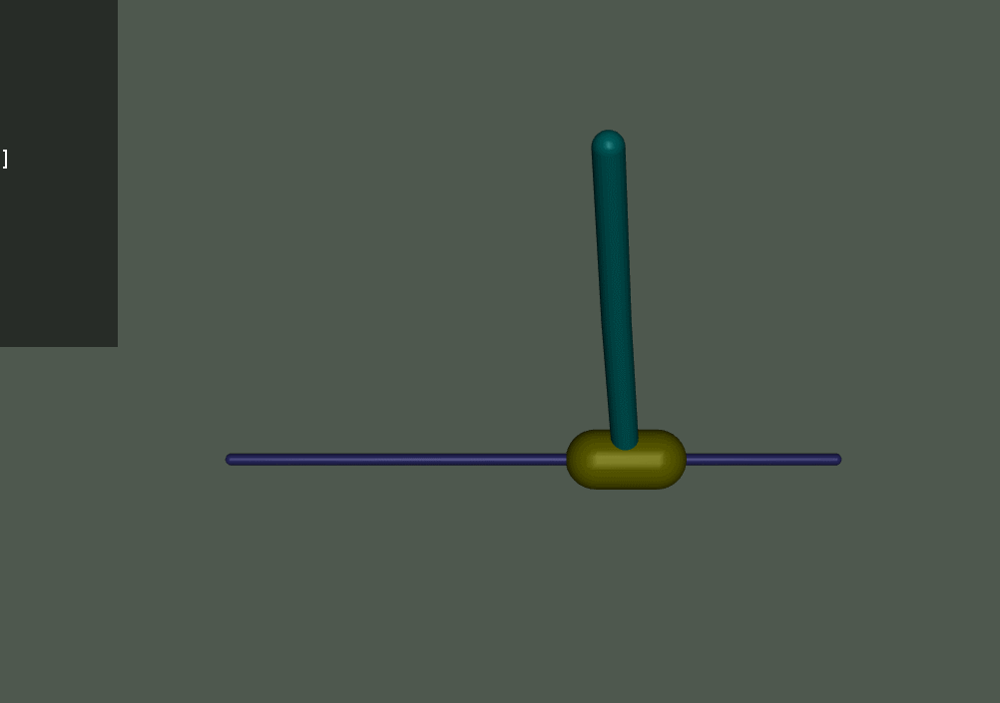

# USD-Inverted-Double-Pendulum
Double deep QLearning and A3C algorithms on InvertedDoublePendulum-v2 from OpenAI Gym.



### Requirements:
Mujoco (1.50 for Windows) from [https://www.roboti.us/index.html](https://www.roboti.us/index.html)

PyTorch > 1.0

imageio-ffmpeg for recording videos of simulation

### Usage:

Run it from `src` directory:
```
python main.py
```
for training with default parameters. Default algorithm is DDQN.

##### Available parameters:
  `--algorithm {A3C,DDQN}`   Algorithm to use.

  `--load_file LOAD_FILE` Custom filename from which to load models before rendering.<br>
  By default, trained models are saved to file `<algorithm>--<episodes>-<threads>-<discount>-<step_max>-<actor_lr>-<critic_lr>`<br>
  For example: `A3C--1000000-5-0_99-5-0_001-0_001`

  `--threads THREADS`    Number of threads for A3C.

  `--episodes EPISODES`   Number of episodes for training process.

  `--discount DISCOUNT`   Discount rate.

  `--step_max STEP_MAX`  Max actor's steps before update of global model in A3C.

  `--actor_lr ACTOR_LR`  Actor's learning rate.

  `--critic_lr CRITIC_LR` Critic's learning rate.

  `--eval_repeats EVAL_REPEATS` Number of evaluation runs in one performance evaluation. Set to 0 to disable evaluation during training.

  `-no_log`  Disable logging during training.

  `-render`  Render environment. Before rendering, there must exist a model
  saved in a file which name is generated based on parameters or explicitly provided.

  `--lr` Learning rate.

  `--min_episodes`  We wait "min_episodes" many episodes in order to aggregate enough data before starting to train.

  `--eps` Probability to take a random action during training.

  `--eps_decay` After every episode "eps" is multiplied by "eps_decay" to reduces exploration over time.

  `--eps_min`  Minimal value of "eps".

  `--update_step` After "update_step" many episodes the Q-Network is trained "update_repeats" many times with a batch of size "batch_size" from the memory.

  `--batch_size` See above.

  `--update_repeats` See above.

  `--seed` Random seed for reproducibility.

  `--max_memory_size` Size of the replay memory.

  `--measure_step` Every "measure_step" episode the performance is measured.

  `--measure_repeats` The amount of episodes played in to asses performance.

  `--hidden_dim` Hidden dimensions for the Q_network.

  `--horizon` Number of steps taken in the environment before terminating the episode (prevents very long episodes).

  `--render_step` See above.

  `--num_actions` Number of action space to discretize to